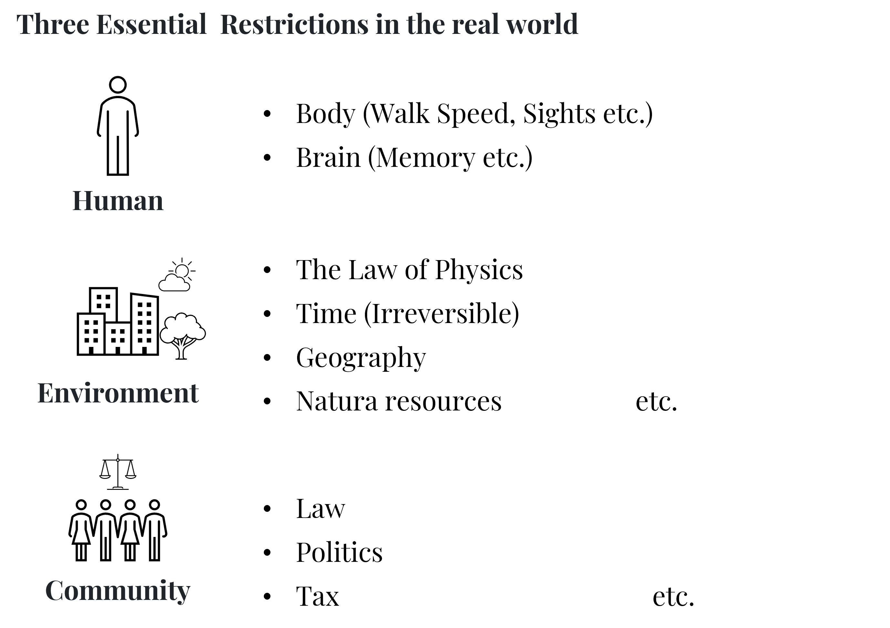
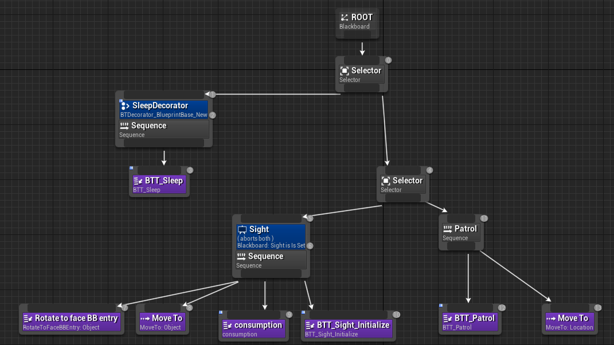
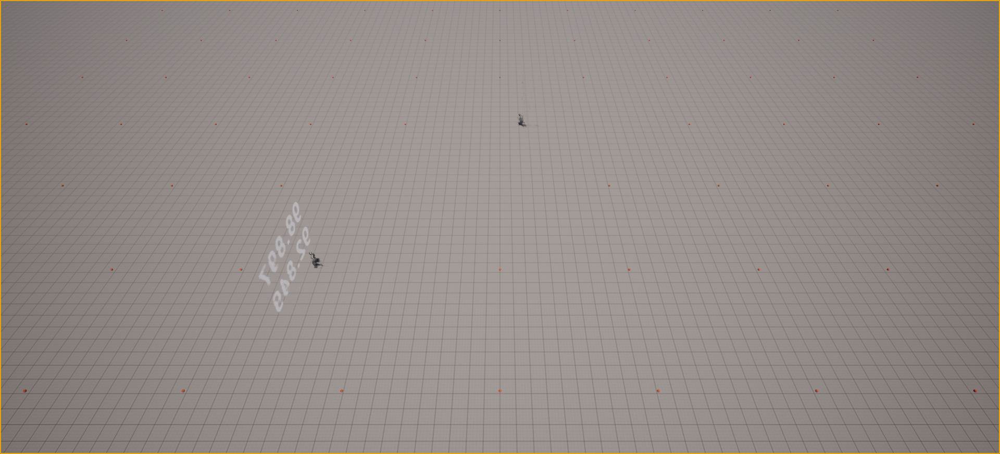
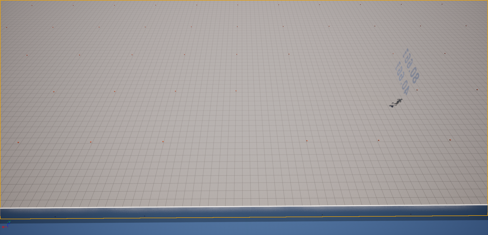
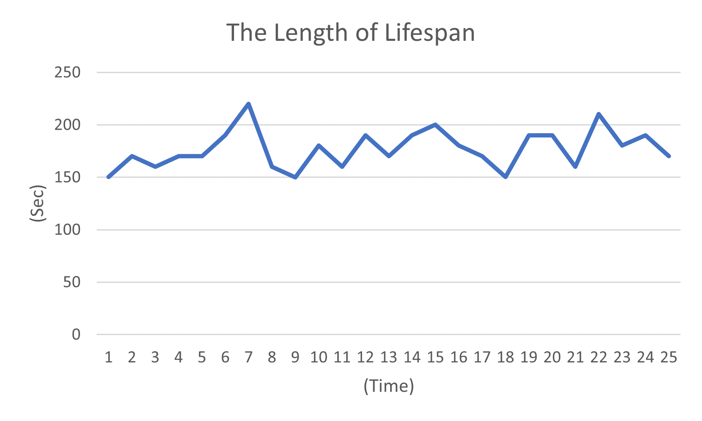
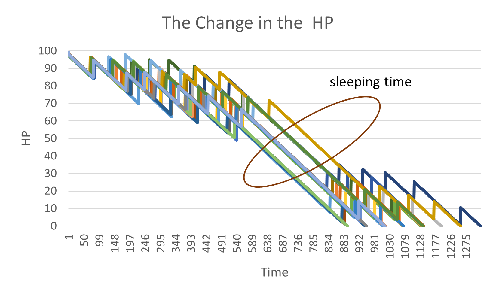
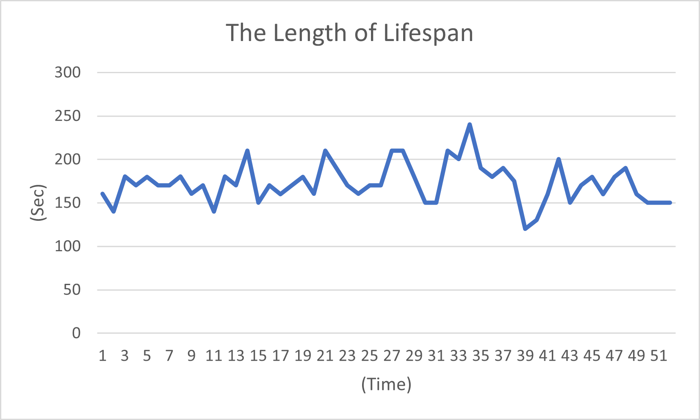
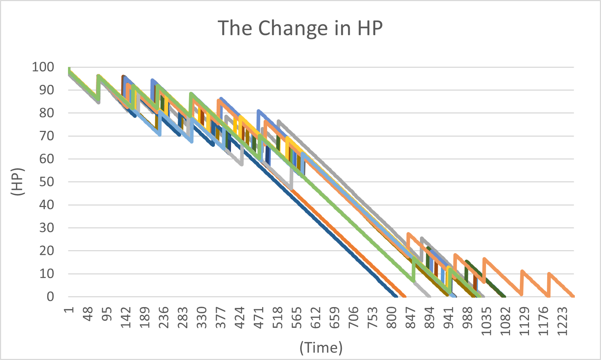
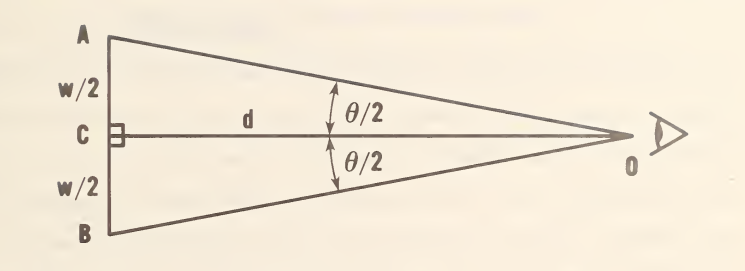
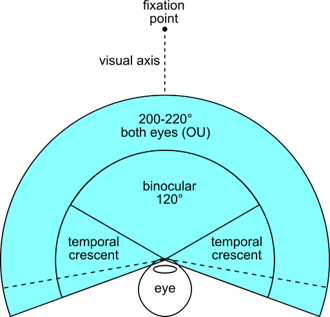

# Basic Simulation of the Digital Twin for Economics

# Summary

Digital Twin is a virtual represntation of a physicail objectg or real wolrd system. This will help make us understandings many kind of counterfactual events for the real world even if those does not happen in the real world.
In this paper, I created the basic setting up for a human to begin with the application of the Digital Twin for Economics. He has some simple restrictions such as a power of bodies or something. Also, I made an environment simple. After creating the basic setting, I added new ability for human and enviroment sucha as a wall for environment and a memory for a human.
These setting brought us different results from the basic setting up. Therefore, these restrictions affect the utility of human beings essentialy although the canonical economic model has dicarded or abstracted. So I proposed the economic model to simulate a real world should include these restrictions to get more precise results.

# Introduction

## Digital Twin for Economics
Digital Twins is a virtual representation of a physical object or system that leverages real-time data, advanced analytics, and simulation techniques to provide insights, support decision-making, and optimize performance throughout the lifecycle of the object or system. Based on the Digital Twin, various technologies such as Internet of Things (IoT), sensors, data analytics, artificial intelligence (AI), and virtual reality (VR) are used. They enable the collection of real-time data from the physical object or system, which is then used to create a virtual counterpart that mimics its behavior and responds to changes in real-time.

Economics for Digital Twin is the measure with Digital Twin technologies to analyze the real economy through the virtual economy. With the difference from the most economic model, the goal not is to give the good explanation for the economy through the abstracted and simple model but to copies the real and complex world in the virtual machine. The start point of this measure is completely different from canonical economic models.

The reason of the difference with the canonical economic model is from mainly three sides. The first one is that Digital Twin model has the geographical restriction. In the most canonical economic model, they often focuses on the market that give a price to good from the quantity of the demand and the supply, and the other factors, such as the geographical setting up, in the canonical model is simplified too much. So we cannot identify why a same kind of a good has different costs and need longer time to be supplied to a market. The geographical restriction also produce the difference in the resources and environments of nature for each areas and so it can bring us to expand the possibility of more precise analysis to weight on the resources that can produce industries for nations and the relation between economic and nature for the sustainability.

The second aspects is to focuses on the time restriction. In the canonical model, the time is often dealt with a term from the starts to the end. For example, the time $t$ in the DSGE model is considered as the quarterly of the year because the data set for the GDP is releases by each quarterly of the year. This is the completely correct approach and does not have any problems to analyze if people always be in the centralized market. However, in the real world, human need to do something to take a time, including join in the centralized market. For example, please imagine a daily life of the normal workers. They have a breakfast at their home, go to their workplace to work, head to the market to buy some foods, and go back to their home to have them and go sleep at their home. Their action needs a time. So they think required time to do in their decision, not only asset allocation. Of course, if you want to weigh the result of the activity in the market, you still do not have to weigh the time restriction. However, as I will explain later in this paper, sometimes human's utility will be met outside the market and even if they do not pay money, such as walk around good places. In the canonical model, these activities in the human is not focused on.

The third aspect is to focuses on the human restriction. Human beings cannot get full information to the world where they live, and memorize all of them. Also, they cannot move from a place to another faraway place in the blink of eye, and fly to the sky and spaces without a airplane and a rocket. These limits a menu of their actions and decisions in the real world. As a matter of course, there is no superman in the real world.

These three restrictions, a geographical restriction, a time restriction and human restriction, is the major restriction in the Digital Twin economic model and improve analysis for economics. Also, they can bring us other benefits because these restriction make economic model more realistic.

## Goal for the  1st Attempt

To achieve our final goal, we need to cumulate some small steps that does not looks like far away from the final goal. However, as it is said that Rome is not be able to be built one day suddenly, we go forward with our enough patient.

The 1st step is to create an primitive human being who can act like an animal, and an primitive environment which has only a kind of food that is not depriciated, an final good that is regularly located. Also there is no other restrictions or settings in the model.

Besides, I tried to create other enivronments that is slightly changed from the basic one. And then, I compared them to the basic one to find the effect of environment in the primitive model. This idea that the change in the restriction of the enveiroment around human beings will affect human beings' utility essentialy is little considered by many canonical macro economic model. Therefore, this attempt is expected to try throwing a stone into solid ideas.

# Assumptions and Settings

## Human beings

### Assumptions
- Human beings is like animal who accords only two desires (the desire of appetite and sleeping) for their acts.
  
- They are going to be dead if the desire of appetite is lower than 100
  
- They are going to be sleep if the desire of sleeping is lower than 5 until it will be restored at around 90
  
- No memory, No other desire

### Settings

#### [Behavior Tree]

[Desire for Appetite]
- Patrol if there is nothing on their sights on the perceptions
- Move if there is some foods on their sights on the perceptions
- Have foods

[Desire for Sleep]
- Stop and Get Sleep if the desire for sleep is under 5
- Increases the desire for sleep while being sleep
- Re-Moving if the desire fore sleep is over 90

## Environment
- Apples are on the ground which can be eaten by human beings.

## Community
- No any restrictions

# Simulation

## Base
- I tried to execution this simulation at 25 times

https://youtu.be/bjMbSA3Y2Y0

## Half
https://www.youtube.com/watch?v=lSqyQv6jtYU

https://youtu.be/bjMbSA3Y2Y0

# Result

## Base

### Time

In this case, their consumtion is for only foods (apple) and that connects directly with their HP.
So, their level of the utility shows their lifetime span in this simulation.

With results on it, the average of their lifetime span is 177.05.

### HP
And then, their activity for HP is in the following.

Once they got sleep, they stop their activity to get HP, so they gonna dead before they will get slep at the second time.
Besides on this, this case does not give new food at the same place as they got it at once. So, as time goes, it will be harder for them to find new food.

## Half

### Time

With results on it, the average of their lifetime span is 172.82.

### HP

## Discussion on the comparison between Base and Half

177.05. 172.82

# Conclusion

This case is the most simple to find an food at the Digital Twin for Economic model with two persons. There are two human beings with two desires for appetite adn sleep but without any memories. Also, the environment has multiple foods regularly, and so human beings are going to try to find them to have. Also, there are no restriction by community.

As a result of this, the average of their lifetime span is 177.05. They cannot live a life two days because they get starving in their slept and it is going to be harder for them to find new food as time goes.

# Reference

- Howett, G. L. (1983). Size of letters required for visibility as a function of viewing distance and observer visual acuity (No. NBS TN 1180 Final Rpt.).
- Howard, I. P., & Rogers, B. J. (1995). Binocular vision and stereopsis. Oxford University Press, USA.

# Appendix

## a. Restriction on Human

### a.1 Eye sight and angle

Gerald (1983) shows the example of the mathematical analysis of visual acuity by Shellen, which is

$$
w_S=1.45 \times 10^{-5}\times S \times d
$$

where $w_s$ is the lenght or width of the object, is $S$ is the measure of the vision($S$/20), and $d$ is the distance between their eyes and the object.

Also, Howard (1995) shows the binocular vision covers 114 degrees of the visual field in humans, and so we assume human beings in the digital world have the visual field at its degrees.

### a.2 Walk speed

### a.3 Memory

## b. Restriction on Environment

### b.1 Time

In this setting, a second in the digital world is considered to be equal to a hour in the real world.

### b.2 Field

The field in this setting is simply plain and there is no any bumpy roads.

### b.3 Object
In this setting, apple is the only object that we can see, which diamter is assumed at 15 cm.

### c. Community
There are not any restriction on the community because of the simple settings.

