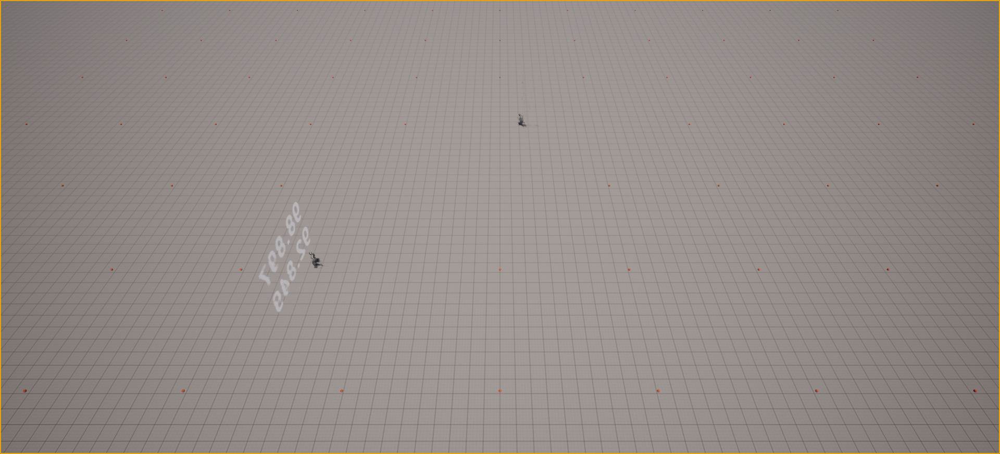
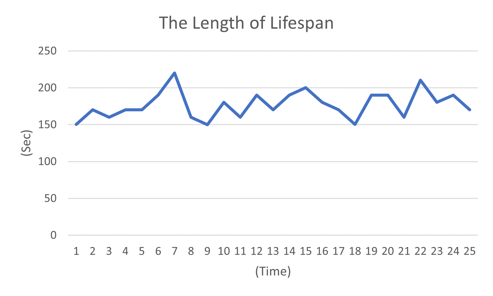
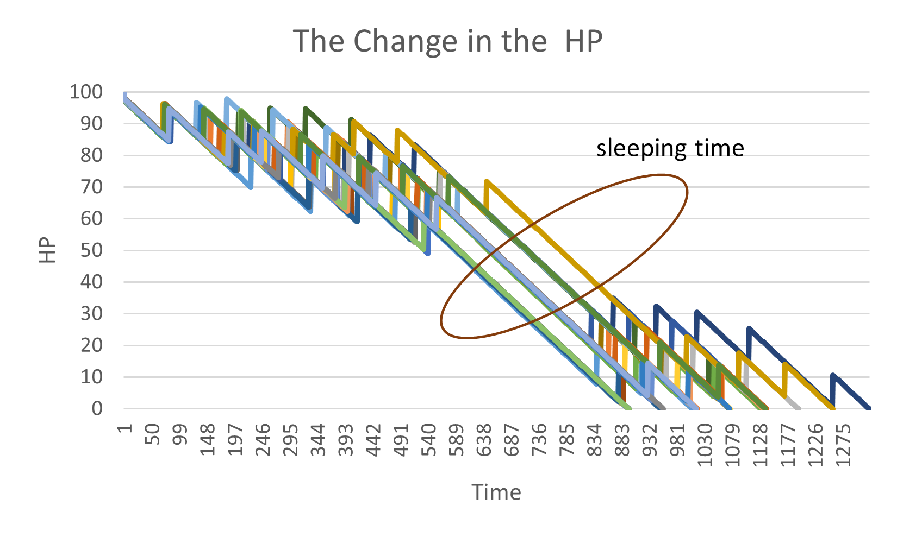

# EDT

# 1st

## Assumptions

### Human beings
- Human beings is like animal who accords only two desires (the desire of appetite and sleeping) for their acts.
  
- They gonna be dead if the desire of appetite is lower than 100
  
- They gonna be sleep if the desire of sleeping is lower than 5 until it will be restored at around 90
  
- No memory, No other desire
  
### Environment
- Apples are on the ground which can be eaten by human beings.

### Community
- No any restrictions

## Result

https://youtu.be/bjMbSA3Y2Y0

